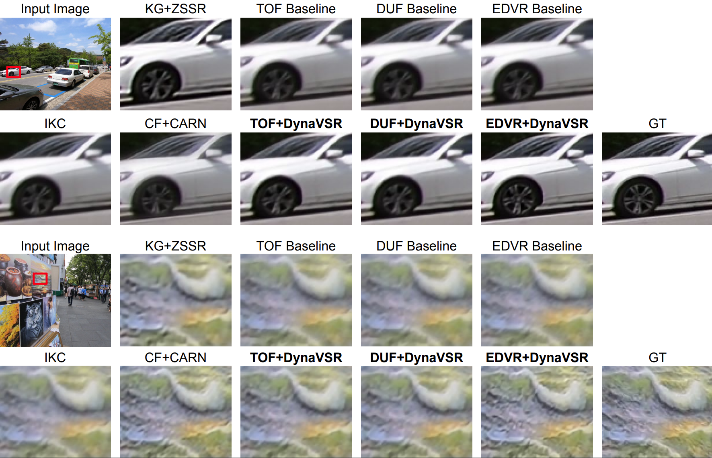

# DynaVSR
## DynaVSR: Dynamic Adaptive Blind VideoSuper-Resolution
#### Suyoung Lee\*, Myungsub Choi\*, Kyoung Mu Lee
#### Seoul National University

This repository is the official implementation of DynaVSR, which is accepted in WACV2021.

Link: [Paper(Arxiv)](http://arxiv.org/abs/2011.04482) | [Paper(CVFOpenAccess)](https://openaccess.thecvf.com/content/WACV2021/papers/Lee_DynaVSR_Dynamic_Adaptive_Blind_Video_Super-Resolution_WACV_2021_paper.pdf) 

## Directory Structure

``` text
project
│   README.md
└───dataset - make symbolic link of your data here
└───pretrained_models - put the downloadedpretrained model here
└───codes
│   └───data
│       │   common.py
│       │   data_sampler.py
│       │   old_kernel_generator.py
│       │   random_kernel_generator.py
│       └───baseline - for finetuning the VSR network
│       └───estimator - for training MFDN, SFDN
│       └───meta_learner - training maml network
│   └───data_scripts - miscellaneous scripts (same as EDVR)
│   └───metrics - metric calculation (same as EDVR)
│   └───models - model collections
│   └───options
│       └───test - ymls for testing the networks
│       └───train - ymls for training the networks
│       │   options.py
│   └───scripts
│   └───utils
|   calc_psnr_ssim.py - code for calculating psnrs and ssims for image sets
|   degradation_gen.py - code for generating the preset kernel
|   make_downscaled_images.py - code for making true slr images
|   make_slr_images.py - code for making slr images generated by MFDN, SFDN
|   train.py - code for training the VSR network
|   train_dynavsr.py  - code for training DynaVSR
|   train_mfdn.py - code for training MFDN, SFDN network
|   test_maml.py - code for testing DynaVSR
|   test_Vid4_REDS4_with_GT(_DUF, _TOF).py - code for testing baseline VSR network
|   run_downscaling.sh - scripts for generating LR, SLR images
|   run_visual.sh - scripts for testing DynaVSR
| ...
```

## Dependencies

Current version is tested on:

- Ubuntu 18.04
- Python==3.7.7
- numpy==1.17
- [PyTorch](http://pytorch.org/)==1.3.1, torchvision==0.4.2, cudatoolkit==10.0
- tensorboard==1.14.0
- etc: pyyaml, opencv, scikit-image, pandas, imageio, tqdm

``` text
# Easy installation (using Anaconda environment)
conda env create -f environment.yml
conda activate dynavsr
```

## Model

<center></center>

## Dataset Preparation

- **[Vimeo90K](http://toflow.csail.mit.edu/)**: Training / **[Vid4](https://drive.google.com/drive/folders/10-gUO6zBeOpWEamrWKCtSkkUFukB9W5m)**: Validation
- **[REDS](https://seungjunnah.github.io/Datasets/reds)**: Training, Validation
  - download *train_sharp* data
- after downloading the dataset, use run_downscaling.sh to make lr, slr images
  - `sh codes/run_downscaling.sh`
- make symbolic link to the datasets.

## Downloading Pretrained Models
- You can download pretrained models using the link: [[Google Drive](https://drive.google.com/drive/folders/1zkeCbsS6Eb6e8IZqb34lxa6gNlZLKGNv?usp=sharing)]


## Usage

- To run EDVR, first install [Deformable Convolution](https://arxiv.org/abs/1703.06211). We use [mmdetection](https://github.com/open-mmlab/mmdetection)'s dcn implementation. Please first compile it.
  ```
  cd ./codes/models/archs/dcn
  python setup.py develop
  ```
### Training
Two ways to train DynaVSR network.
- Distributed training(When using multiple GPUs).
  ```
  cd ./codes
  python -m torch.distributed.launch --nproc_per_node=8 --master_port=4321 train_dynavsr.py -opt options/train/[Path to YML file] --launcher pytorch --exp_name [Experiment Name]
  ```
- Single GPU training.
  ```
  cd ./codes
  python train_dynavsr.py -opt options/train/[Path to YML file] --exp_name [Experiment Name]
  ```

### Testing

- We just support single GPU for testing. 
  - To use your own test set, change the dataroot in [`EDVR_Demo.yml`](https://github.com/esw0116/DynaVSR/blob/master/codes/options/test/EDVR/EDVR_Demo.yml#L37) file to the folder containing images.

  ```
  cd ./codes
  python test_dynavsr.py -opt options/test/[Path to YML file]
  ```


- Or just use [`run_visual.sh`](https://github.com/esw0116/DynaVSR/blob/master/codes/run_visual.sh) (Uncomment line that you want to execute).
  ```
  sh ./codes/run_visual.sh
  ```

## Results

<center></center>

<br>

## Update Log
- [2020-12-09] First code cleanup, Publish pretrained models
- [2020-12-29] Add arbitrary input data testing script
- [2021-01-05] Add script for testing 4X scale EDVR models
- [2021-01-06] Modify scripts for generating LR, SLR frames

## Acknowledgement

The code is built based on 

- [EDVR-Pytorch](https://github.com/xinntao/EDVR)
