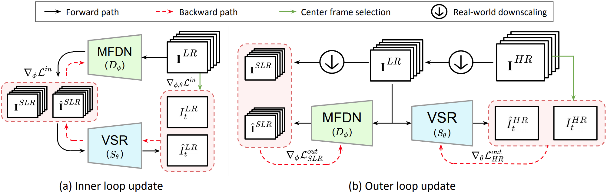

# DynaVSR
DynaVSR: Dynamic Adaptive Blind VideoSuper-Resolution


## Directory Structure

``` text
project
│   README.md
└───dataset - make symbolic link here
└───codes
│   └───data
│       │   common.py
│       │   data_sampler.py
│       │   old_kernel_generator.py
│       │   random_kernel_generator.py
│       └───baseline - for finetuning the VSR network
│       └───estimator - for training MFDN, SFDN
│       └───meta_learner - training maml network
│   └───data_scripts - miscellaneous scripts (same as EDVR)
│   └───metrics - metric calculation (same as EDVR)
│   └───models - model collections
│   └───options
│       └───test - ymls for testing the networks
│       └───train - ymls for training the networks
│       │   options.py
│   └───scripts
│   └───utils
|   calc_psnr_ssim.py - code for calculating psnrs and ssims for image sets
|   degradation_gen.py - code for generating the preset kernel
|   make_downscaled_images.py - code for making true slr images
|   make_slr_images.py - code for making slr images generated by MFDN, SFDN
|   train.py - code for training the VSR network
|   train_dynavsr.py  - code for training DynaVSR
|   train_mfdn.py - code for training MFDN, SFDN network
|   test_maml.py - code for testing DynaVSR
|   test_Vid4_REDS4_with_GT(_DUF, _TOF).py - code for testing baseline VSR network
```

## Dependencies

Current version is tested on:

- Ubuntu 18.04
- Python==3.7.7
- numpy==1.17
- [PyTorch](http://pytorch.org/)==1.3.1, torchvision==0.4.2, cudatoolkit==10.0
- tensorboard==1.14.0
- pywavelets==1.1.1

``` text
# Easy installation (using Anaconda environment)
conda create -n dynavsr
conda activate dynavsr
conda install python=3.7
conda install pip numpy
conda install pytorch torchvision cudatoolkit=10.0 -c pytorch
pip install tensorboard==1.14
pip install pywavelets
```

## Model

<center></center>

## Dataset Preparation

- **[Vimeo90K](http://toflow.csail.mit.edu/)**: Training
- **[Vid4](https://drive.google.com/drive/folders/10-gUO6zBeOpWEamrWKCtSkkUFukB9W5m)**: Validation
- **[REDS](https://seungjunnah.github.io/Datasets/reds)**: Training, Validation
  - download *train_sharp* data
- after downloading the dataset, use run_downscaling.sh to make lr, slr images
  - `sh codes/run_downscaling.sh`
- make symbolic link to the datasets.


## Usage

## Results

<center></center>


## Acknowledgement

The code is built based on 

- [EDVR-Pytorch](https://github.com/thstkdgus35/EDSR-PyTorch)

